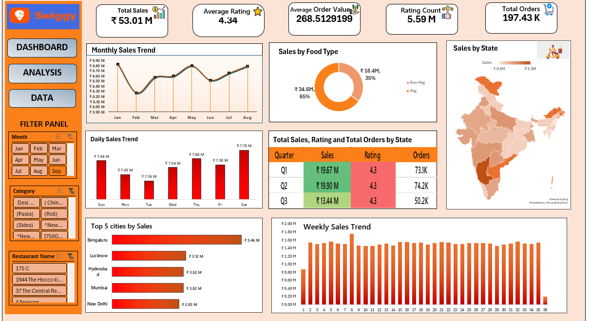

# Swiggy Sales Dashboard | Excel Data Analytics Project

## Overview
This project is an interactive Excel dashboard designed to analyze Swiggy sales performance, customer behavior, and regional business trends.

The dashboard transforms raw sales data into actionable business insights through dynamic visualizations and KPI tracking.

---

## Business Problem
Food delivery businesses generate large volumes of transactional data daily. This dashboard helps monitor:

- Sales performance
- Customer engagement
- Order trends
- Regional contribution
- Food category performance

---

## Dashboard Features

- KPI Cards
- Monthly, Weekly and Daily Sales Trends
- State-wise Sales Analysis
- Top Cities Performance
- Veg vs Non-Veg Analysis
- Customer Ratings Analysis
- Interactive Filters & Slicers

---

## Tools Used

- Microsoft Excel
- Pivot Tables
- Pivot Charts
- Slicers
- Conditional Formatting
- Dashboard Design

---

## Dashboard Preview

---

## Project Outcome

This dashboard helped strengthen my skills in:

- Data Visualization
- Business Analytics
- KPI Reporting
- Interactive Dashboard Design

---

## Author

Rajalaxmi Sahoo
